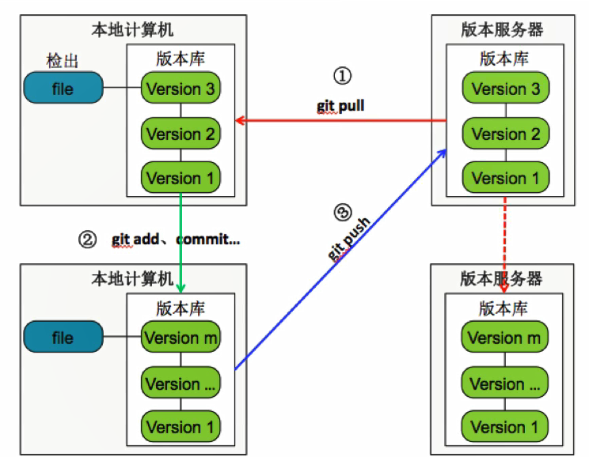

#### 为什么要使用Git?

- 本地建立版本库
- 本地版本控制
- 多主机异地协同办公
- 重写提交说明
- 可以后悔
- 更好用的提交列表
- 更好的差异比较
- 更完善的分支系统
- 速度贼快

#### Git基础

- 直接记录快照，而非差异比较

- 近乎所有操作都在本地执行

- 时刻保持数据的完整性

- 多数操作仅是添加数据

- Git文件(已被纳入版本库管理的文件)的三种状态：

  - 已修改（modified）：在工作目录修改Git文件
  - 已暂存（staged）：对已修改的文件执行Git暂存操作，将文件存入暂存区
  - 已提交（committed）：将已暂存的文件执行Git提交操作，将文件存入版本库


  


#### 本地版本库与服务器版本库之间的关系




#### 配置 git 的用户

- 修改 /etc/gitconfig 文件（几乎不会使用）
  - `git config --system`
- 修改 ~/.gitconfig 文件 (较为常用)
  - `git config --global`
- 针对于特定项目的， .git/config 文件
  - `git config --local`

```bash
# git config
usage: git config [<options>]

Config file location
    --global              use global config file
    --system              use system config file
    --local               use repository config file

```

