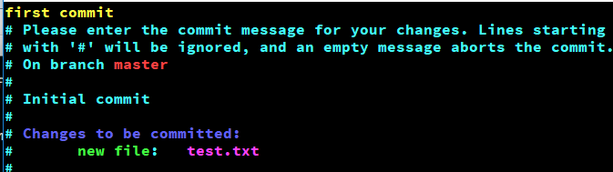

#### `git init`初始化Git版本库

```bash
# git init
Initialized empty Git repository in E:/Learn/shell/mygit/.git/
```

会随之生成相应的文件：

```bash
# ls -al
drwxr-xr-x 1 Yangle 197121 0 11月 13 01:36 .git/
```

销毁Git环境：

- 将 .git文件删除即可

  ```bash
  # rm -rf .git/
  ```

#### `git status` 查看Git文件的状态

创建一个文件，然后随便输入一些内容;

```bash
# echo "hello test.txt" >> test.txt
# cat test.txt
hello test.txt
```

查看test.txt的文件状态：

```bash
# git status test.txt
On branch master

Initial commit

Untracked files:
  (use "git add <file>..." to include in what will be committed)

        test.txt

nothing added to commit but untracked files present (use "git add" to track)

```

可以看出，这是一个初始的提交，test.txt 处于未追踪的状态。


####  `git add [FileName]` 将已修改的文件加入的Git的暂存区中

```bash
# git add test.txt
# git status test.txt
On branch master

Initial commit

Changes to be committed:
  (use "git rm --cached <file>..." to unstage)

        new file:   test.txt
```

当前的`test.txt`已被纳入Git暂存区了。

- 如何从 暂存区 回退到已修改状态？

  ```bash
  #  git rm --cached test.txt
  rm 'test.txt'
  
  Yangle@DESKTOP-2L22GDH MINGW64 /e/Learn/shell/mygit (master)
  # git status test.txt
  On branch master
  
  Initial commit
  
  Untracked files:
    (use "git add <file>..." to include in what will be committed)
  
          test.txt
  
  nothing added to commit but untracked files present (use "git add" to track)
  
  ```

  此时 test.txt 文件又回到了刚刚已修改的状态了。


#### `git commit`将暂存区的所有修改提交到Git的版本库中

```bash
# git commit
```

当执行 commit 命令后，会出现一个文本文件供你输入提交信息：



在该文本文件中输入提交信息（first commit）后，保存该文件（ESC —> wq）；

提交后会出现相应提交信息：

```bash
# git commit
[master (root-commit) e6587eb] first commit
 1 file changed, 3 insertions(+)
 create mode 100644 test.txt
# git status
On branch master
nothing to commit, working tree clean
```

可以看出 test.txt 已被提交至Git版本库中，并当前暂存区没有什么可以提交的了。


#### `git log` 查看 commit 提交日志

```bash
# git log
commit e6587ebc026e3bdd630154b5bc5629deab9f0fbe (HEAD -> master)
Author: zhangyuqing <coderzyq@163.com>
Date:   Tue Nov 13 02:01:06 2018 +0800

    first commit

```

`e6587ebc026e3bdd630154b5bc5629deab9f0fbe` 为当前 commit 的 id，实际上由sha1算法计算出来的摘要值。

- 可以由  `git commit -m "提交信息" ` 替代如上步骤，开发中也比较常用。

#### `git checkout -- [FileName] 放弃修改的内容`

- 注意：`--`与`FileName`直接的空格

对 test.txt 文件新增一行内容

```bash
# cat test.txt
hello test.txt
add 123

```

查看当前test.txt的状态：

```bash
# git status
On branch master
Changes not staged for commit:
  (use "git add <file>..." to update what will be committed)
  (use "git checkout -- <file>..." to discard changes in working directory)

        modified:   test.txt

no changes added to commit (use "git add" and/or "git commit -a")

Yangle@DESKTOP-2L22GDH MINGW64 /e/Learn/shell/mygit (master)
```

放弃刚刚新增的内容

```bash
# git checkout -- test.txt

Yangle@DESKTOP-2L22GDH MINGW64 /e/Learn/shell/mygit (master)
# git status
On branch master
nothing to commit, working tree clean

```

查看 test.txt

```bash
# cat test.txt
hello test.txt

```

发现 新增的 add 123 内容已被删除。


#### `git rest HEAD [file]` 由已暂存状态回退到已修改状态（与 git rm --cached 类似）

```bash
# git status
On branch master
Changes to be committed:
  (use "git reset HEAD <file>..." to unstage)

        modified:   test.txt


Yangle@DESKTOP-2L22GDH MINGW64 /e/Learn/shell/mygit (master)
# git reset HEAD test.txt
Unstaged changes after reset:
M       test.txt

Yangle@DESKTOP-2L22GDH MINGW64 /e/Learn/shell/mygit (master)
# git status
On branch master
Changes not staged for commit:
  (use "git add <file>..." to update what will be committed)
  (use "git checkout -- <file>..." to discard changes in working directory)

        modified:   test.txt

no changes added to commit (use "git add" and/or "git commit -a")

```

可以看出，原先已被加入暂存区的 test.txt文件，被重新回退到了已修改状态。


#### `git rm`删除一个文件

- 有2个作用：
  - 1.删除了一个文件
  - 2.将被删除的文件纳入到暂存区（stage, index）

```bash
# git rm text2.txt
rm 'text2.txt'
# git status
On branch master
Changes to be committed:
  (use "git reset HEAD <file>..." to unstage)

        deleted:    text2.txt
# ll
total 1
-rw-r--r-- 1 Yangle 197121 10 11月 13 02:29 test.txt


```

可以看出 text2.txt 文件被删除，同时在目录下也被物理删除了。

当然，删除文件后，也需要进行 commit 。	

- 怎么将 删除的文件 恢复回来？

  ```bash
  # git reset HEAD text2.txt  // 将被删除的文件从暂存区恢复到工作区
  Unstaged changes after reset:
  D       text2.txt
  
  Yangle@DESKTOP-2L22GDH MINGW64 /e/Learn/shell/mygit (master)
  
  # git checkout -- text2.txt // 将工作区的修改丢弃
  
  Yangle@DESKTOP-2L22GDH MINGW64 /e/Learn/shell/mygit (master)
  # ll
  total 2
  -rw-r--r-- 1 Yangle 197121 10 11月 13 02:29 test.txt
  -rw-r--r-- 1 Yangle 197121 11 11月 14 00:14 text2.txt
  
  Yangle@DESKTOP-2L22GDH MINGW64 /e/Learn/shell/mygit (master)
  # cat text2.txt
  test2.txt
  
  ```

  可以看出 text2.txt 文件被恢复过来了。

- 与 系统命令`rm [File] 的区别`

  - rm 命令删除时，被删除的文件未被纳入git暂存区


#### `git mv` 重命名

```bash
# git mv text2.txt test2.txt 

Yangle@DESKTOP-2L22GDH MINGW64 /e/Learn/shell/mygit (master)
# git status  // mv 命令后，可以看出已被纳入git暂存区
On branch master
Changes to be committed:
  (use "git reset HEAD <file>..." to unstage)

        renamed:    text2.txt -> test2.txt

```

- 与系统命令 `mv [src] [desc]`命令的区别：系统命令操作后，不会被纳入git的暂存区

####  `git log`查看提交历史

- -p 展开显示每次提交的内容差异

  ```bash
  # git log -p
  commit a0b2b99dd731cebd53600d46f185c5f31e3d672a (HEAD -> master)
  Author: zhangyuqing <coderzyq@163.com>
  Date:   Wed Nov 14 00:26:37 2018 +0800
  
      重命名文件
  
  diff --git a/text2.txt b/test2.txt
  similarity index 100%
  rename from text2.txt
  rename to test2.txt
  
  commit 0029fc500e6195d8435897307572ac9204f9739f
  Author: zhangyuqing <coderzyq@163.com>
  Date:   Wed Nov 14 00:04:00 2018 +0800
  
      添加 text2.txt
  
  diff --git a/test.txt b/test.txt
  index 16c71cb..3a3c3e2 100644
  --- a/test.txt
  +++ b/test.txt
  @@ -1,3 +1 @@
  -hello test.txt
  -
  -hello 123
  +hello 456
  diff --git a/text2.txt b/text2.txt
  new file mode 100644
  index 0000000..4f48a3d
  --- /dev/null
  +++ b/text2.txt
  @@ -0,0 +1 @@
  +test2.txt
  
  ```

- -n 仅显示最近的n次更新

  ```bash
  # git log -2
  commit a0b2b99dd731cebd53600d46f185c5f31e3d672a (HEAD -> master)
  Author: zhangyuqing <coderzyq@163.com>
  Date:   Wed Nov 14 00:26:37 2018 +0800
  
      重命名文件
  
  commit 0029fc500e6195d8435897307572ac9204f9739f
  Author: zhangyuqing <coderzyq@163.com>
  Date:   Wed Nov 14 00:04:00 2018 +0800
  
      添加 text2.txt
  
  ```

- --stat 仅显示简要的增改行数统计

- --pretty=oneline

  ```bash
  # git log --stat --pretty=oneline
  a0b2b99dd731cebd53600d46f185c5f31e3d672a (HEAD -> master) 重命名文件
   text2.txt => test2.txt | 0
   1 file changed, 0 insertions(+), 0 deletions(-)
  0029fc500e6195d8435897307572ac9204f9739f 添加 text2.txt
   test.txt  | 4 +---
   text2.txt | 1 +
   2 files changed, 2 insertions(+), 3 deletions(-)
  e6587ebc026e3bdd630154b5bc5629deab9f0fbe first commit
   test.txt | 3 +++
   1 file changed, 3 insertions(+)
  
  ```

-  --pretty=format:"%h - %an,%ar : %s"

  ```bash
  # git log --pretty=format:"%h - %an,%ar : %s"
  a0b2b99 - zhangyuqing,10 minutes ago : 重命名文件
  0029fc5 - zhangyuqing,32 minutes ago : 添加 text2.txt
  e6587eb - zhangyuqing,23 hours ago : first commit
  
  
  ```

- #### 获取git帮助,,- git help config,- git config --help,- man git-config


