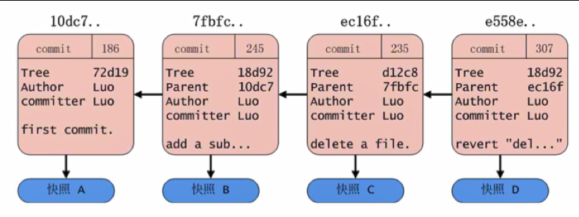
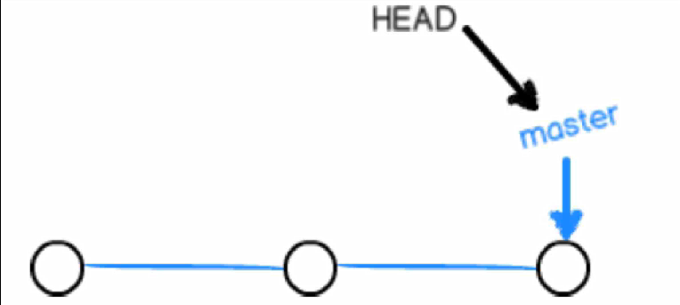
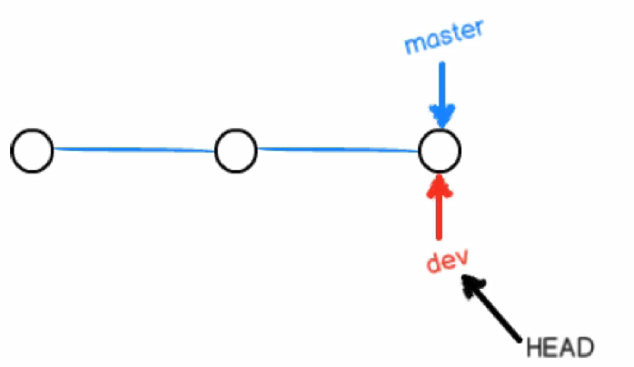
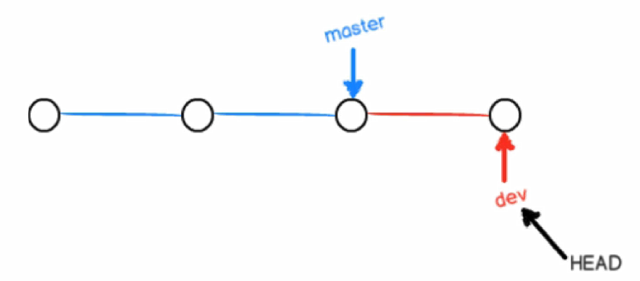
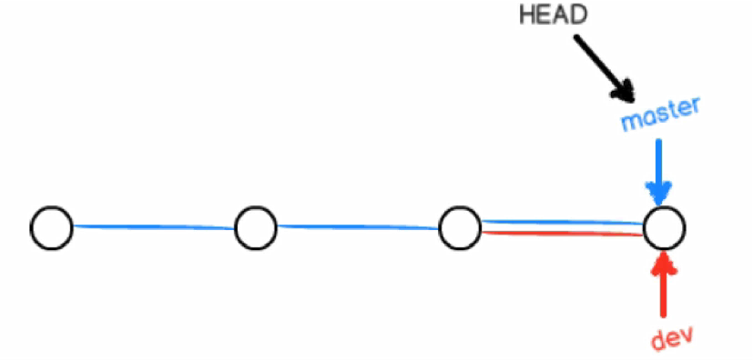

### 分支

```
分支是Git管理中一个核心的概念，在日常工作中，必不可少。
```

### 常用命令介绍

- 查看当前本地分支

  ```bash
  # git branch
  * master
  
  ```

- 创建新的本地分支

  ```bash
  # git branch b1
  Yangle@DESKTOP-2L22GDH MINGW64 /e/Learn/shell/mygit (master)
  $ git branch
    b1
  * master
  	
  ```

- 切换分支

  ```bash
  # git checkout master  // 切换到master分支
  Switched to branch 'master'
  
  Yangle@DESKTOP-2L22GDH MINGW64 /e/Learn/shell/mygit (master)
  $ git branch
    b1
  * master
  ```

  - 切换到上一个分支的快捷方式

    ```bash
    $ git checkout -
    Switched to branch 'b1'
    
    Yangle@DESKTOP-2L22GDH MINGW64 /e/Learn/shell/mygit (b1)
    $ git checkout -
    Switched to branch 'master'
    
    ```

    可以看到在 b1 分支和 master 分支之间来回切换

  - 创建分支并同时切换过去，git为我们提供了一个快捷的方式

    - `git checkout -b [branchname]` = `git branch [branchname]` + `git checkout [branchname]`

    ```bash
    $ git checkout -b b3
    Switched to a new branch 'b3'
    
    Yangle@DESKTOP-2L22GDH MINGW64 /e/Learn/shell/mygit (b3)
    $ git branch
    * b3
      master
    ```


- 删除一个分支

  ```bash
  $ git branch -d b1
  Deleted branch b1 (was a0b2b99).
  
  Yangle@DESKTOP-2L22GDH MINGW64 /e/Learn/shell/mygit (master)
  $ git branch
  * master
  
  ```

  可以看出，b1 分支已被删除

  - 不可以删除当前分支

    ```bash
    $ git branch
    * b2
      master
    
    Yangle@DESKTOP-2L22GDH MINGW64 /e/Learn/shell/mygit (b2)
    $ git branch -d b2
    error: Cannot delete branch 'b2' checked out at 'E:/Learn/shell/mygit'
    
    ```

    会提示错误。

  - 将要被删除的分支有未被合并的内容，使用 git branch -d 删除会被阻止

    - 1.在b2分支创建新的内容，并commit
    - 2.切换回master分支，对b2分支进行删除操作

    ```BASH
    $ git branch -d b2
    error: The branch 'b2' is not fully merged.
    If you are sure you want to delete it, run 'git branch -D b2'.
    ```

    此时可以使用 `git branch -D [branchname]来进行删除`

    ```bash
    $ git branch -D b2
    Deleted branch b2 (was 6c292c6).
    ```


- 合并分支

  - 在 b3 分支下创建 b3.txt 文件

  - 添加到暂存区，并提交

  - 切换回 master分支

    ```bash
    $ git merge b3
    Updating a0b2b99..2ac2ffe
    Fast-forward
     b3.txt | 1 +
     1 file changed, 1 insertion(+)
     create mode 100644 b3.txt
    
    Yangle@DESKTOP-2L22GDH MINGW64 /e/Learn/shell/mygit (master)
    $ ll
    total 3
    -rw-r--r-- 1 Yangle 197121 11 11月 23 23:41 b3.txt
    -rw-r--r-- 1 Yangle 197121 10 11月 13 02:29 test.txt
    -rw-r--r-- 1 Yangle 197121 11 11月 14 00:20 test2.txt
    ```

    可以看出 b3 分支下创建的 b3.txt 文件已被合并到 master 分支。

  - 当b3分支合并到 master分支后，就可以使用`git branch -d [branchName]`来删除了。而不必使用`-D`选项


- 显示本地分支，最近的一次提交记录信息

  ```bash
  $ git branch -v
    b3     2ac2ffe Create b3.txt
  * master 2ac2ffe Create b3.txt
  ```

- 解决冲突

  - 在master分支中创建 test3.txt 文件，并提交；

  - 切换到 dev f分支，也创建 test3.txt 文件，写入不同的内容，并提交；

  - 切换回 master 分支，并进行合并操作 ： `git merge dev`

    ```bash
    $ git merge dev
    Auto-merging test3.txt
    CONFLICT (add/add): Merge conflict in test3.txt
    Automatic merge failed; fix conflicts and then commit the result.
    ```

    可以看出，提示 test3.txt 文件由冲突。

    ```bash
    $ cat test3.txt
    <<<<<<< HEAD   # HEAD 部分代表了当前分支的内容
    hello master
    =======
    hello dev
    >>>>>>> dev    # dev 代表了 dev分支中的内容
    ```

    解决完冲突后：

    ```bash
    $ git status
    On branch master
    You have unmerged paths.
      (fix conflicts and run "git commit")
      (use "git merge --abort" to abort the merge)
    
    Unmerged paths:
      (use "git add <file>..." to mark resolution)
    
            both added:      test3.txt
    ```

    查看状态，可以看出冲突已被解决。

    此时需要使用 git add 命令告诉git，冲突已被解决。注意，此处的 git add并不是将 test3.txt文件由工作区添加到暂存区，因为此时 test3.txt显然已经处于暂存区。git add只是告诉Git将test3.text文件冲突已经被解决了。

    ```bash
    $ git add .
    
    Yangle@DESKTOP-2L22GDH MINGW64 /e/Learn/shell/mygit (master|MERGING)
    $ git status
    On branch master
    All conflicts fixed but you are still merging.
      (use "git commit" to conclude merge)
    
    Changes to be committed:
    
            modified:   test3.txt
    ```

    当add过后，git会提示虽然冲突被解决，但是此时仍然处于合并状态，需要再次commit。

### 分支的原理

一个 commit 对象链：一条工作记录线



快照A作为这条线的第一个commit记录，记录了 提交的信息。快照B是快照A的一个提交，其中的 Parent指针，指向了快照A，以此类推，整个的提交记录有机的组成了一条线。

#### HEAD 和 master

- HEAD 指向的是当前分支
- master 指向提交




此时master指向了第三次提交，HEAD指向了master分支。




在master分支的基础上，创建了dev分支。只是创建了一份新的指针(SVN会将整份代码拷贝一份)，dev与master指向了同一份提交。HEAD指向了dev，表示当前分支已由master分支切换到dev。形同如下操作：

```bash
# git branch dev
# git checkout dev
```

- HEAD 在哪呢？

  答案：在.git目录下

  ```bash
  $ cat HEAD   # HEAD中的内容
  ref: refs/heads/master
  ```




​	这表示在dev分支上又做了一次提交，dev领先了master分支一次提交。




​	将dev分支的内容合并到 master 分支上。


